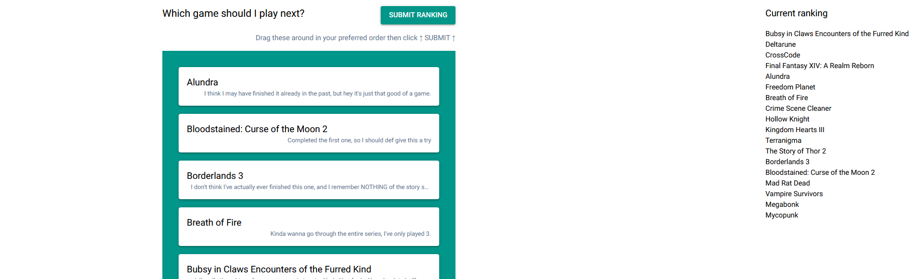
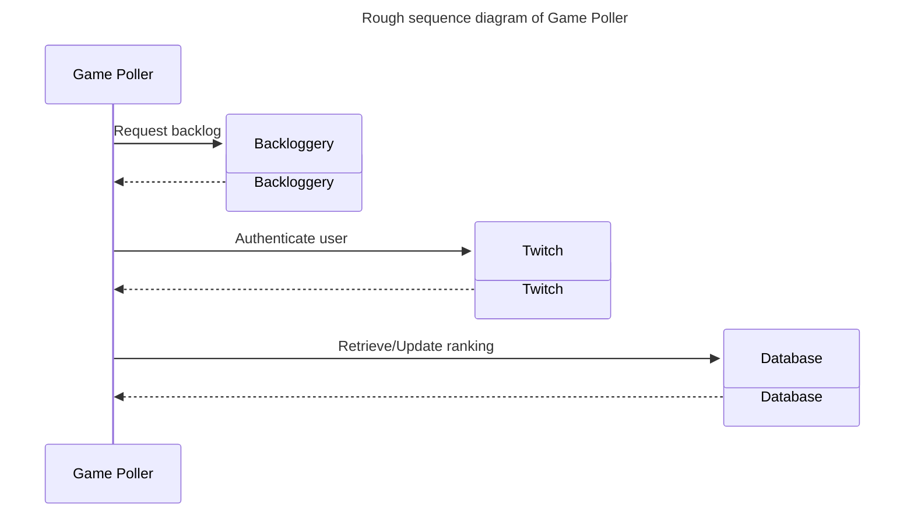

# Game Poller
Give your Twitch viewers a way to vote on which game from your backlog your should play next.


## How does it work?
The game list is fetched from your Backloggery account, then displayed as a list to the user. Shelved and paused games are omitted.

The user can then rank that list in their preffered order andsubmit that ranked vote.

The ranking is based on a sum of all the votes for each game.

Authentication is done via a standard no-scope Twitch OAuth. No private data is obtained by this app.



## How to set up
> ***Disclaimer:** this section assumes you have a solid understanding of baremetal deployment.*
> 
> *No there is no docker image provided. \
> Yes you are welcome to create one and share that around.*
> 
> *If you are starting from scratch, [@kovalp](https://github.com/kovalp)'s guide can help you a lot with this section: https://community.hetzner.com/tutorials/deploy-nicegui*

* Clone the files on your server.
* Create a venv with the provided requirement file.
* Register the app on the Twitch side. Go to https://dev.twitch.tv/console/apps for this and provide the following information:
  * **Name:** whatever you want, this is the name of the app that will be shown to user when they authenticate
  * **OAuth Redirect URLs:** ``https://YOUR_APP_URL/twitch_callback``
  * **Category:** I have no idea, and I cannot find anything anywhere that explains this. Personally I chose "Website Integration".
  * **Client Type:** Confidential
* Generate your client secret and hold on to it for the next step.
* Credentials are stored in a separate file called **creds.json**. Create this file with the following format. And, obviously, *make sure this file isn't served to the users.*
````json
[{
  "db": {
    "host": "host address like localhost",
    "user": "database user",
    "password": "#database pw",
    "database": "database name"
  },
  "twitch": {
    "client_id": "your twitch client id",
    "client_secret": "your twitch client secret",
    "redirect_uri": "redirect uri"
  },
  "backloggery": {
    "user": "your Backloggery username"
  },
  "run": {
    "port": "whatever port you desire",
    "storage_secret": "whatever string you want here but please don't leave this default string for the love of god please put something yourself"
  }

}]
````
* Create a MySQL database called whatever you decided in the creds file (if you don't have a MySQL server running, install that first obviously). 
* Here's the DDL for the table:
````mysql
CREATE TABLE `votes` (
  `twitch_user` varchar(100) NOT NULL,
  `game` varchar(100) NOT NULL,
  `score` tinyint unsigned NOT NULL,
  PRIMARY KEY (`twitch_user`,`game`),
  UNIQUE KEY `votes_user_IDX` (`twitch_user`,`game`) USING BTREE
) ENGINE=InnoDB DEFAULT CHARSET=utf8mb4 COLLATE=utf8mb4_0900_ai_ci;
````
* All that's left is to configure your server to serve the app. Use whichever tool you want.
  * I used Nginx for the serving, and a simple systemctl for running the app, but anything else would work.
* Don't forget to get the domain certified, since Twitch APi requires the connection to be HTTPS (but I mean, it's 2025, what reason could you ever have to not use HTTPS?)

## What's next?
I think it would be nice if the color and filter could be customized in a config file. If I update this project, I'll add that.

## Notes
* There is no official public API yet for Backloggery, so this can break at any moment if the endpoints change.
* This uses MySQL. If you need it to use something else, you'll need to change the send_games_to_db() and get_game_ranking() functions accordingly.
* Graphic design is quite obviously NOT my passion.
